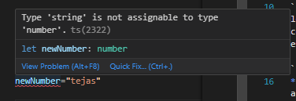

# Types of Varibles

```
let varible_name : data_type = value

```

Eg: 

```
let name: string = "Tejas Mundhe!";
console.log(name);
export {};

```
* Remeber you dont have to use ':' and datatype typescript smartly convert to datatype and avoid future assign of other number 
```
let newNumber=32424
newNumber="tejas"


```


* Note :
if we do name=7 it will give error
